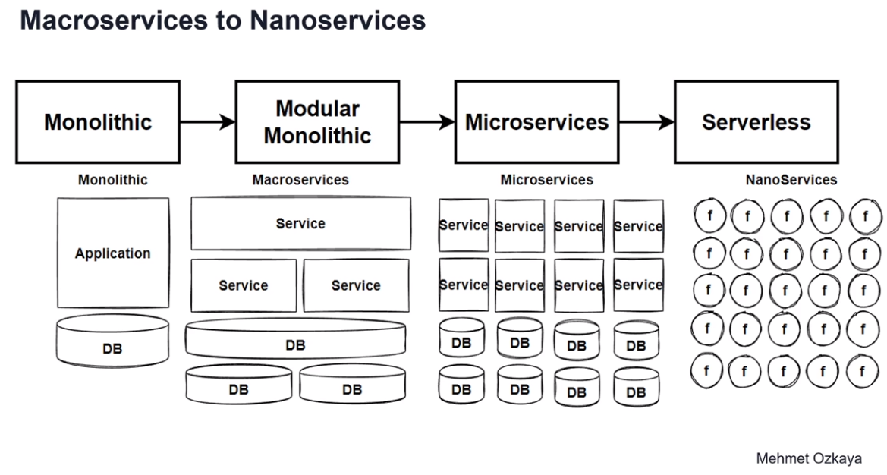
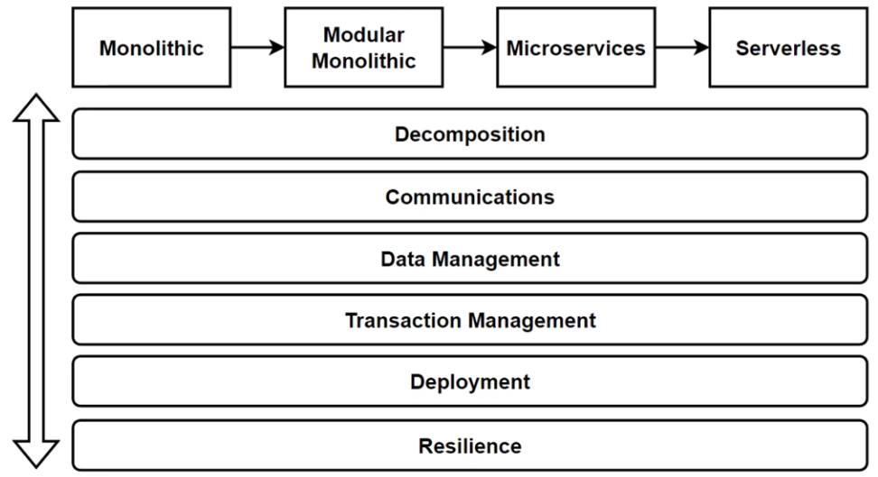
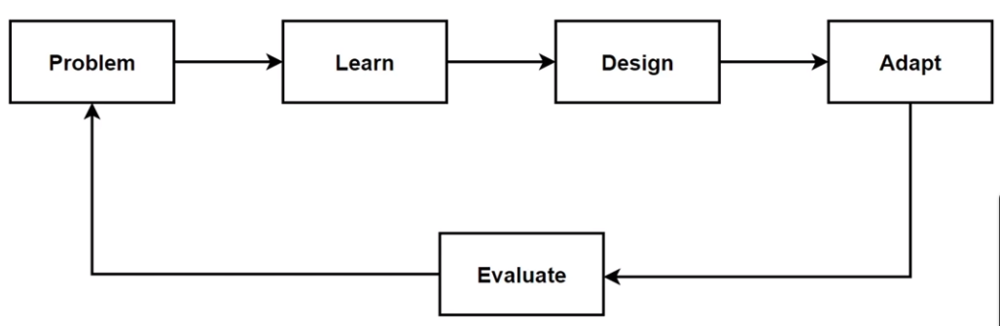
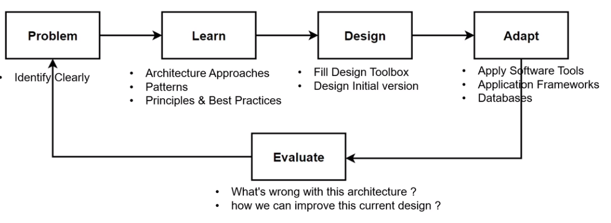
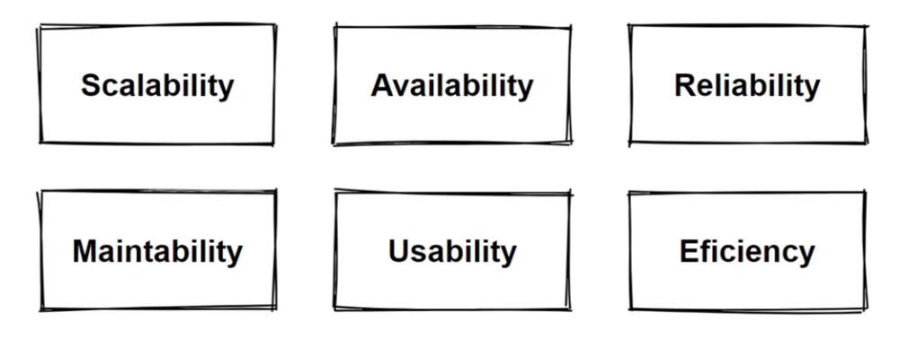

# Microservices Architecture with Patterns and Principles

this could be the most comprehensive guide for microserviecs architecure design from a high level POV

I made this in a progressive manner, solving problems and refactoring (migrating) from monolithic to modular monolithic to microservices then to serverless

this guide focuses only on the serverside, another guid will be released for _Micro Frontends_ that discusses clientside architecture

If you want more follow me on [Linkedin](https://www.linkedin.com/in/kareem-anees-0496b62b3) where I post updates

this is a follow up with cuorse by _Mohamad Ozkaya_ on _O'reilly_

**Warning:** _This article is written by a human_

# Intro

this intro tells basic overview about what the course is about

## Progress

this is how the considreations when building every architecture will look like (from up to down)

also this is how the course will progress

thus we will define our problem, learn how to silve it, design soloution, then evaluate it

## Non-functional Requirements

