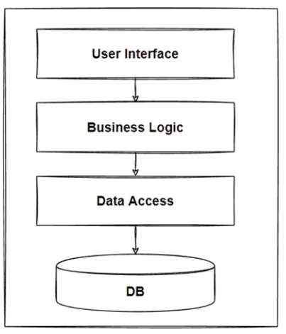
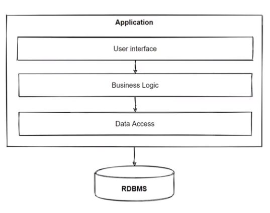
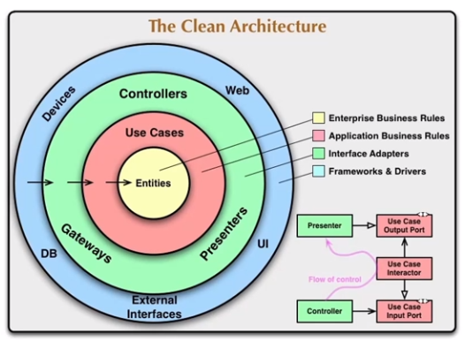
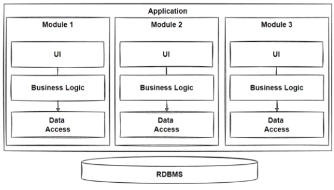
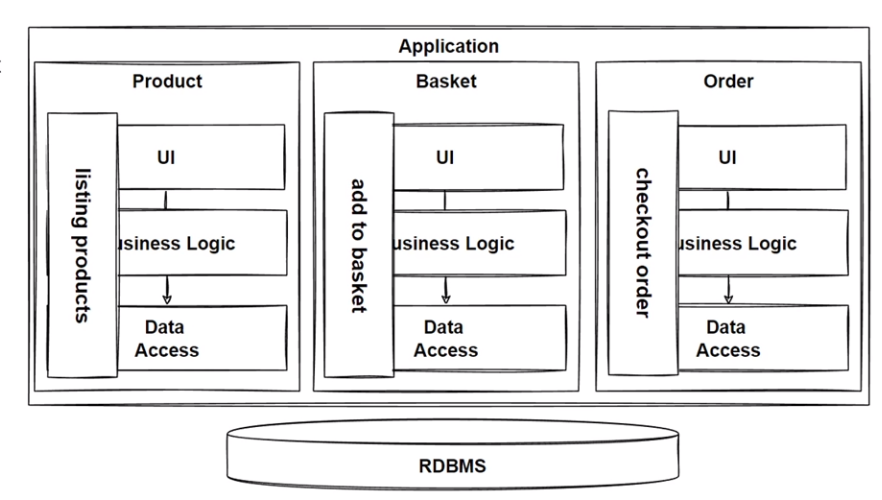
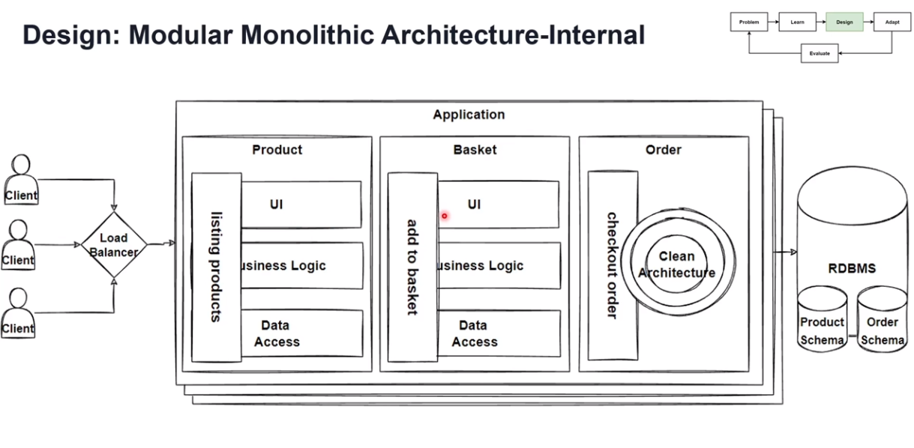
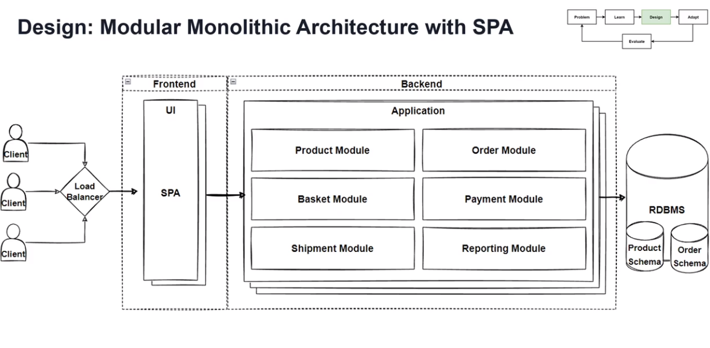

# Microservices Architecture with Patterns and Principles

this could be the most comprehensive guide for microserviecs architecure design from a high level POV

I made this in a progressive manner, solving problems and refactoring (migrating) from monolithic to modular monolithic to microservices then to serverless

this guide focuses only on the serverside, another guid will be released for _Micro Frontends_ that discusses clientside architecture

If you want more follow me on [Linkedin](https://www.linkedin.com/in/kareem-anees-0496b62b3) where I post updates

this is a follow up with cuorse by _Mohamad Ozkaya_ on _O'reilly_

**Warning:** _This article is written by a human_

# Intro

this intro tells basic overview about what the course is about

### Progress

this is how the considreations when building every architecture will look like (from up to down)

also this is how the course will progress

thus we will define our problem, learn how to silve it, design soloution, then evaluate it

### Non-functional Requirements

# Monolithic

a **Strict** monolithic app has a single codebase for everything

**When to use monolithic**

- when the app is simple
- when no load
- when want fast development for an MVP

**Advantages**

- easy to build, test, deploy, secure, **scale**

**Challenges**

- comlexity over time

- harder to refactor

- expencive to scale and hard with loads

**There is not too much to talk anout in monolithic, it is very simple**

## Layered Architecture

it is separating code into layers

like API patterns

**the rest of this chapter doesn't really tell anything new**

all the action will start with the monolithic section

## Clean architecure

this chapter is inspired by the book **_Clean architecure_**

- the outer layers depends on the inner layers

- any change in the system should not affect entities, and any change in the entities can break it's users

- inner layers have no information about outer layers

## Modular Monolithic

Simply, the codebase is separated into multiple independent modules (processes)

example

### communication

simply using interprocess communication as they are all on the same machine

### Transaction management

using basic DBMS transactions techniques is fairly enough as they use the same database server

### evaluation

### Headless Architecture

it is separating the UI (view) into Its own module and the backend into it's own module

---

### Problem with modular monolithic

messing

- flexibility in deployment

- simplicity in refactoring

- separeate scaling of indevidual modules

microservices solves these

# Microsevices

everything else will be about Microservices
